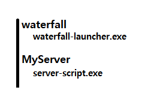

# Waterfall Launcher
## Waterfall 실행기

### 설정하기
- CLI 및 JSON 기반 설정을 지원합니다

1. [Releases](https://github.com/dolphin2410/waterfall-launcher/releases) 에서 원하는 아키텍쳐의 빌드 버전을 다운로드 받습니다.

2. `server.conf.json` 파일을 이용해 서버를 설정합니다. ( 필수 x )

3. `waterfall-launcher[.exe]`를 실행합니다.

### server.conf.json
다음과 비슷하게 설정하세요.
```json
{
    "server": "https://paper-fetcher.netlify.app/paper?project=waterfall&version=1.18",
    "backup": true,
    "restart": true,
    "memory": 8,
    "plugins": [
        "<PLUGIN1_URL>",
        "<PLUGIN2_URL>",
        "<PLUGIN3_URL>"
    ],
    "jvm_args": [
        "--Dcom.mojang.xxx=true"
    ],
    "no_update": true,
    "servers": {
        "MyServer": "./server-script.exe --no-update"
    }
}
```

### servers
`Waterfall`이 프록시 해줄 서버를 자동으로 켜줍니다.

1. `server.conf.json`에서 설정합니다
2. `servers` 오브젝트에 `"<서버경로>":"<실행 명령어>"` 형태로 서버를 추가 합니다.
    - 예를 들어 다음과 같은 경우, `Waterfall` 서버 폴더가 있는 폴더 안 `MyServer` 폴더 안에서 `./server-script.exe --no-update` 명령어를 실행합니다.
    ```json
    {
        ...
        "servers": {
            "MyServer": "./server-script.exe --no-update"
        }
    }
    ```
    - 구조는 다음과 같습니다.
    
    


### CLI
***`server.conf.json`에서 설정하지 않고 CLI에서 직접 설정 및 실행할 수 있습니다. `server.conf.json`에 중복되는 설정이 있을때, 갈아엎습니다***
- 서버 URL
```bash
waterfall-launcher.exe --server https://paper-fetcher.netlify.app/paper?project=waterfall&version=1.17 # 서버 jar URL 설정
```
- 메모리
```bash
waterfall-launcher.exe --memory 8 # 8GB 설정
```
- 백업
```bash
waterfall-launcher.exe --backup # 서버 종료 후 자동 백업
```
- 재시작
```bash
waterfall-launcher.exe --restart # 서버 종료 후 자동 재시작
```
- no-update
```bash
waterfall-launcher.exe --no-update # 서버가 존재하지 않는 경우에만 다운로드 받기 (매번 다운로드 하지 않는다)
```

## Notice
- Based on server-script
